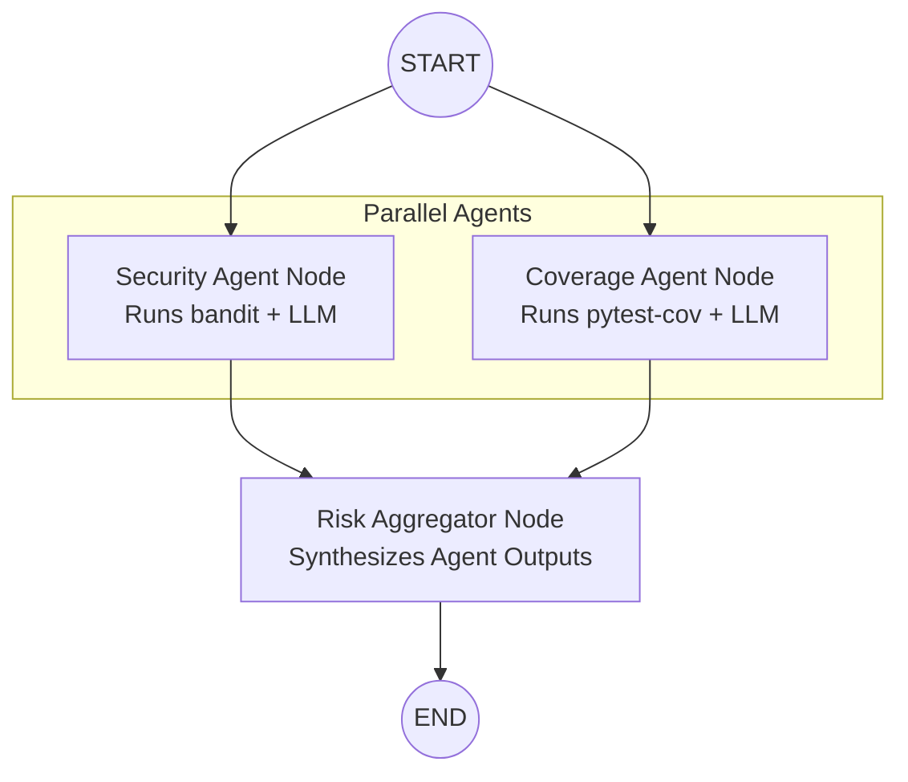

# 🚀 ReviewPilot

**ReviewPilot** is an agentic, AI-powered Pull Request reviewer built with **LangGraph** and **Groq**. Instead of relying on a human to manually read every changed file and check for security issues or missing tests, ReviewPilot automates the process using a multi-agent system. 

It fetches PR data from GitHub, runs specialized code-analysis tools, and uses LLMs to intelligently synthesize those findings against the actual code diffs.

---

## ✨ Features

- **Multi-Agent Architecture**: Built with LangGraph's stateful graph orchestration. Agents run in parallel to review code efficiently.
- **Security Agent**: Runs `bandit` (static security analysis) on changed files. The LLM acts as a security engineer, filtering out false positives and focusing on genuine vulnerabilities based on context.
- **Coverage Agent**: Dynamically clones the PR's code branch, runs `pytest-cov`, and asks an LLM to assess the risk of untested lines of code.
- **Risk Aggregator**: A "Lead Code Reviewer" synthesis agent that waits for the parallel agents to finish and combines their structured reports into a final `RiskVerdict`.
- **Structured JSON Outputs**: Uses LangChain and Pydantic to force the LLMs (running on Llama 3.3 via Groq) to return strictly typed, parseable data.
- **Speed**: Powered by Groq's lightning-fast inference hardware.

---

## 🛠️ Architecture (Data Flow)

ReviewPilot operates as an event-driven state machine using a **Fan-Out / Fan-In** pattern:



1. **Start**: PR metadata and file diffs are fetched via PyGithub.
2. **Fan-Out (Parallel execution)**: The `Security Agent` and `Coverage Agent` execute at the same time.
3. **Fan-In (Synthesis)**: The `Risk Aggregator` waits for both parallel agents to complete, processes their structured JSON outputs, and returns a final Go/No-Go decision.

---

## 🚀 Setup & Installation

### 1. Prerequisites
- Python 3.9+
- A GitHub Personal Access Token (PAT)
- A Groq API Key

### 2. Clone and Install
```bash
git clone https://github.com/your-username/ReviewPilot.git
cd ReviewPilot
pip install -r requirements.txt
```

### 3. Environment Variables
Create a `.env` file in the root of the project to store your secrets safely:
```env
GITHUB_TOKEN=ghp_your_github_token_here
GROQ_API_KEY=gsk_your_groq_api_key_here
```

---

## 💻 Usage

Run ReviewPilot from the command line by providing the repository name and the PR number:

```bash
python review.py --repo "owner/reponame" --pr 7
```

### Output Example
The script will output the progress of the graph execution, including the specific findings from each agent, culminating in a final synthesis:

```
==================================================
  FINAL AGGREGATED RISK VERDICT (from graph state)
==================================================
  Recommendation : NEEDS_CHANGES
  Risk Score     : 85 / 100
  Summary        : The PR introduces a high-severity security vulnerability by using `subprocess.run` with untrusted shell input. Additionally, core authentication logic on lines 42-45 lacks test coverage, posing a medium risk of regressions. These must be addressed before merging.
  
  Blocking Issues (1):
    - Fix the command injection vulnerability in auth.py (line 37)
==================================================
```

---

## 📚 Study Guide
For a deeper dive into the code, architecture, and agent design concepts (such as Pydantic structured outputs and LangGraph basics), refer to the included `ReviewPilot_StudyGuide.md`.
